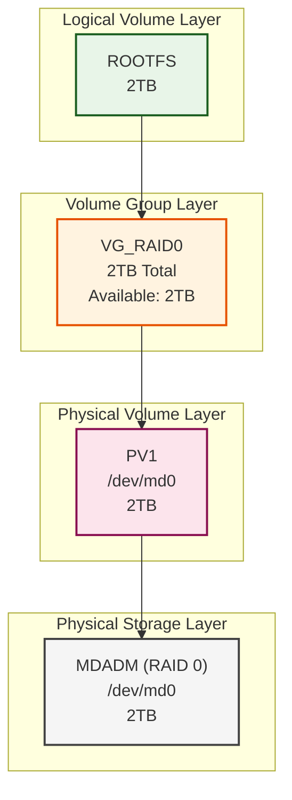

# For Future Me

## Purpose

- READ CAREFULLY [Installation Guide](https://wiki.archlinux.org/title/Installation_guide)
- This is my first time installing Arch Linux. I want to learn new experiences and have a better understanding of the system.
- I do not use `archinstall`. I want to do it manually.
- I did many mistakes for the first time. I didn't read installation guide carefully. After spend a lot of time, I finally got it working. I hope this guide will help future me to avoid the mistakes I made.

## Connect to wifi

```bash
iwctl
# > station wlan0 connect <SSID>
```

## Setup Raid 0 with mdadm

- Follow this [guide](https://wiki.archlinux.org/title/RAID)
- Follow this [Raid Array](https://www.jeffgeerling.com/blog/2021/htgwa-create-raid-array-linux-mdadm)

```bash
pacman -S mdadm
mdadm --misc /dev/nvme0n1
mdadm --misc /dev/nvme1n1
mdadm --create --verbose --level=0 --raid-devices=2 /dev/md0 /dev/nvme0n1 /dev/nvme1n1
mdadm --detail --scan >> /etc/mdadm.conf
# append to this file
# ARRAY /dev/md/<NAME>:0 metadata=1.2 UUID=<UUID>
mkfs.ext4 /dev/md0
```

## Setup LVM

- Follow this [guide](https://wiki.archlinux.org/title/LVM)
- PV (Physical Volume) = Hardware
- VG (Volume Group) = Bridge
- LV (Logical Volume) = Software



```bash
pacman -S lvm2
pvcreate /dev/md0
vgcreate vgraid0 /dev/md0
lvcreate -l 100%FREE -n rootfs /dev/vgraid0
```

## Create partitions

- Use SATA SSD for boot and swap

```bash
fdisk /dev/nvme2n1
# > g
# > n +1G (for bootloader)
# > t uefi
# > n +8G (for ram 64GB)
# > t swap
# > w (write)
```

## Mount Partitions

```bash
mount /dev/vgraid0
mount --mkdir /dev/nvme2n1p1 /mnt/boot
swapon /dev/nvme2n1p2
```

## Install Base System

```bash
pacstrap -K /mnt base linux linux-firmware

# Generate /etc/fstab
genfstab -U /mnt >> /mnt/etc/fstab
```

## Chroot into the new system

```bash
arch-chroot /mnt
```

## Set Details

```bash
ln -sf /usr/share/zoneinfo/Asia/Bangkok /etc/localtime
locale-gen
cat <<EOF > /etc/locale.conf
LANG=en_US.UTF-8
EOF
cat <<EOF /etc/hostname
VM-PC
EOF
passwd
useradd -m -G kk -s /usr/bin/fish
```

## Set Initial Ram Disk

```bash
pacman -S mdadm lvm2

# open /etc/mkinitcpio.conf
# add mdadm_udev and lvm2 to HOOKS
HOOKS=(... block mdadm_udev lvm2 filesystems ...)
# run generate initramfs
mkinitcpio -P
```

## Install Grub

```bash
pacman -S grub efibootmgr

# https://wiki.archlinux.org/title/GRUB
grub-install --target=x86_64-efi --efi-directory=/boot
grub-mkconfig -o /boot/grub/grub.cfg
```
