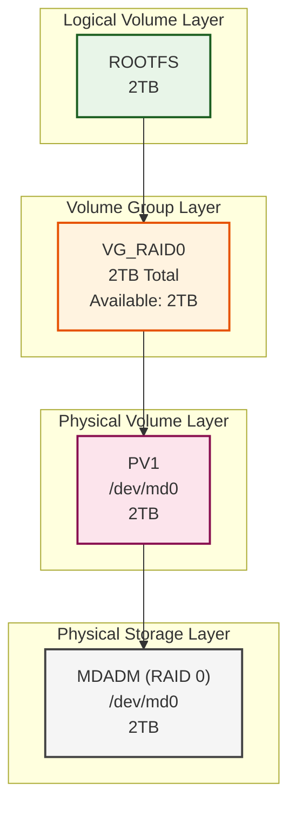

# For Future Me

## Why?

- READ CAREFULLY [Installation Guide](https://wiki.archlinux.org/title/Installation_guide)
- This is my first time installing Arch Linux. I want to learn new experiences and have a better understanding of the system.
- I do not use `archinstall`. I want to do it manually.
- I did many mistakes for the first time. I didn't read installation guide carefully. After spend a lot of time, I finally got it working. I hope this guide will help future me to avoid the mistakes I made.

## Connect to wifi

```bash
iwctl
> station wlan0 connect <SSID>
```

## Update pacman

```bash
pacman -Sy

# Update keys for old live installation
pacman -Sy archlinux-keyring
```

## Setup Raid 0 with mdadm

- Follow this [guide](https://wiki.archlinux.org/title/RAID)
- Follow this [Raid Array](https://www.jeffgeerling.com/blog/2021/htgwa-create-raid-array-linux-mdadm)

```bash
pacman -S mdadm
mdadm --misc /dev/nvme0n1
mdadm --misc /dev/nvme1n1
mdadm --create --verbose --level=0 --raid-devices=2 /dev/md0 /dev/nvme0n1 /dev/nvme1n1
mdadm --detail --scan >> /etc/mdadm.conf
# append to this file
# ARRAY /dev/md/<NAME>:0 metadata=1.2 UUID=<UUID>
mkfs.ext4 /dev/md0
```

## Setup LVM

- Follow this [guide](https://wiki.archlinux.org/title/LVM)
- PV (Physical Volume) = Hardware
- VG (Volume Group) = Bridge
- LV (Logical Volume) = Software


```mermaid
graph TB
subgraph "Logical Volume Layer"
LV1[ROOTFS<br/>2TB]
end

subgraph "Volume Group Layer"
VG1[VG_RAID0<br/>2TB Total<br/>Available: 2TB]
end

subgraph "Physical Volume Layer"
PV1[PV1<br/>/dev/md0<br/>2TB]
end

subgraph "Physical Storage Layer"
M_RAID0["MDADM (RAID 0)"<br/>/dev/md0<br/>2TB]
end

%% Connections between layers
LV1 --> VG1
VG1 --> PV1
PV1 --> M_RAID0

%% Styling
classDef lvLayer fill:#e8f5e8,stroke:#1b5e20,stroke-width:2px
classDef vgLayer fill:#fff3e0,stroke:#e65100,stroke-width:2px
classDef pvLayer fill:#fce4ec,stroke:#880e4f,stroke-width:2px
classDef diskLayer fill:#f5f5f5,stroke:#424242,stroke-width:2px

class LV1,LV2,LV3 lvLayer
class VG1 vgLayer
class PV1,PV2 pvLayer
class M_RAID0 diskLayer
```

```bash
pacman -S lvm2
pvcreate /dev/md0
vgcreate vgraid0 /dev/md0
lvcreate -l 100%FREE -n rootfs /dev/vgraid0
```

## Create partitions

- Use SATA SSD for boot and swap

```bash
fdisk /dev/nvme2n1
> g
> n
> +1G (for bootloader)
> t uefi
> n
> +8G (for ram 64GB)
> t
> swap
> w (write)
```

## Format partitions

```bash
# rootfs
mkfs.ext4 /dev/vgraid0/rootfs

# efi and swap
mkfs.fat -F 32 /dev/efi_system_partition
mkswap /dev/swap_partition
```

## Mount Partitions

```bash
mount /dev/vgraid0/rootfs /mnt
mount --mkdir /dev/efi_system_partition /mnt/boot
swapon /dev/swap_partition
```

## Install Base System

```bash
pacstrap -K /mnt base linux linux-firmware

# Generate /etc/fstab
genfstab -U /mnt >> /mnt/etc/fstab
```

## Chroot into the new system

```bash
arch-chroot /mnt
```

## Set Details

```bash
ln -sf /usr/share/zoneinfo/Asia/Bangkok /etc/localtime

sudo nano /etc/locale.gen
# Uncomment: en_US.UTF-8 UTF-8
locale-gen

cat <<EOF > /etc/locale.conf
LANG=en_US.UTF-8
EOF

cat <<EOF /etc/hostname
VM-PC
EOF

passwd root

useradd -mU kk -s /usr/bin/fish
passwd kk

# visudo NOPASSWD (TOO Risky, But Lazy)
kk ALL=(ALL:ALL) NOPASSWD: ALL
```

## Set Initial Ram Disk

```bash
pacman -S mdadm lvm2

# open /etc/mkinitcpio.conf
# add mdadm_udev and lvm2 to HOOKS
HOOKS=(... block mdadm_udev lvm2 filesystems ...)
# run generate initramfs
mkinitcpio -P
```

## Install Pipewire (Sound)

```bash
pacman -S pipewire-jack pipewire pipewire-pulse
```

## Install Bluez (Bluetooth)

```bash
# pulseaudio-bluetooth (optional)
pacman -S bluez bluez-utils bluedevil
systemctl enable bluetooth.service
```

## Mount External Disks

```bash
lsblk -f

# add into /etc/fstab
# UUID=b8e4a1f6-6e8f-4f6e-8b6e-6e8f4f6e8b6e /mnt/partition ext4 defaults 0 0
UUID=dda55b67-9c78-4798-bb29-beeb7da6f2f6 /mnt/BACKUP_8TB ext4 defaults 0 0
UUID=b474193d-cd24-4258-b735-bea46c595733 /mnt/BACKUP_2TB ext4 defaults 0 0
```

## Install Grub

```bash
pacman -S grub efibootmgr

# https://wiki.archlinux.org/title/GRUB
grub-install --target=x86_64-efi --efi-directory=/boot
grub-mkconfig -o /boot/grub/grub.cfg
```

## Install required tools

```bash
pacman -S man xclip tmux neovim tree ripgrep eza bat zoxide
pacman -S go
pacman -S otf-monaspace
pacman -S diff-so-fancy luarocks yarn
pacman -S torsocks ufw

yarn global add npm
```

## Install default software

```bash
yay -S visual-studio-code-bin obsidian
yay -S vesktop-bin postman-bin
yay -S claude-code claude-desktop-bin
yay -S feishin-bin rssguard
yay -S firefox google-chrome

# tor onion
gpg --auto-key-locate nodefault,wkd --locate-keys torbrowser@torproject.org
yay -S tor-browser-bin

yay -S ollama
systemctl enable ollama
```

## Install Nvidia

- Current driver: `nouveau`
- [Nvidia](https://wiki.archlinux.org/title/NVIDIA)
- [CodeNames](https://nouveau.freedesktop.org/CodeNames.html)
- [OpenRGB](https://archlinux.org/packages/extra/x86_64/openrgb/)

```bash
# peek in pci
lspci -k -d ::03xx

# for 3060 (NV170 - Ampere)
pacman -S nvidia-open
```

## Install Network Manager

```bash
# plasma-nm (Network Manager UI)
pacman -S networkmanager plasma-nm

systemctl enable NetworkManager
```

## Install Desktop Manager

- [Desktop Environments](https://wiki.archlinux.org/title/Desktop_environment)
- [SSDM](https://wiki.archlinux.org/title/SDDM)
- [KDE](https://wiki.archlinux.org/title/KDE)

```bash
pacman -S plasma-desktop kde-applications sddm
systemctl enable sddm
```

## Install YAY (AUR Helper)

```bash
# https://github.com/Jguer/yay
sudo pacman -S --needed git base-devel && git clone https://aur.archlinux.org/yay.git && cd yay && makepkg -si
```

## Podman (Rootless)

```bash
pacman -So podman podman-compose podman-docker
systemctl enable podman.service

mkdir -p ~/.config/containers/systemd/
systemctl --user daemon-reload
```

## UFW

```bash
sudo ufw default deny incoming
sudo ufw default allow outgoing
sudo ufw enable
sudo ufw status verbose

sudo ufw allow ssh
```

## Hidraw

```bash
# on
sudo chmod a+rw /dev/hidraw*

# off
sudo chmod 0600 /dev/hidraw*
```

## VMWare

```bash
yay -S vmware-workstation vmware-keymaps linux-headers --noconfirm

# disable secure boot
sudo modprobe -a vmw_vmci vmmon
```

## Install Anaconda

```bash
yay -S anaconda
```

## Install Dig

- Bind is dns server package includes `dig` command

```bash
yay -S bind
```
